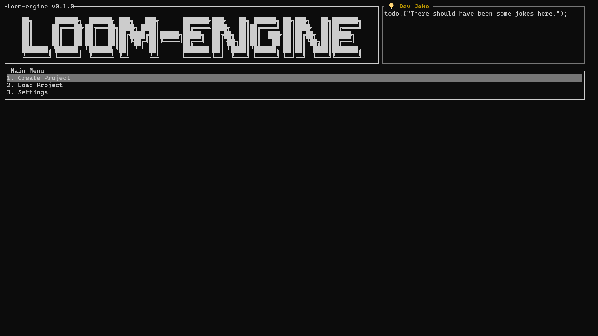
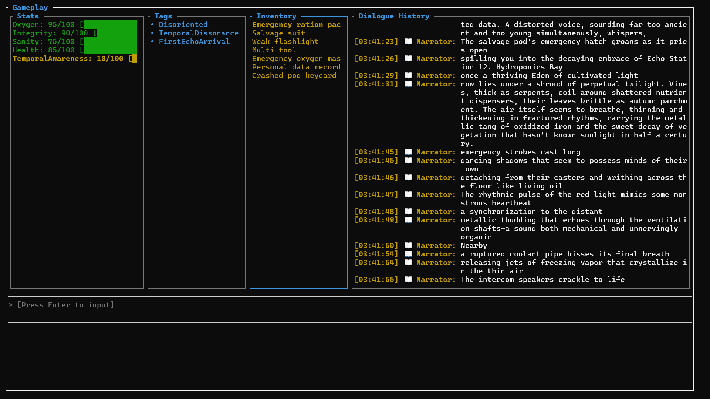
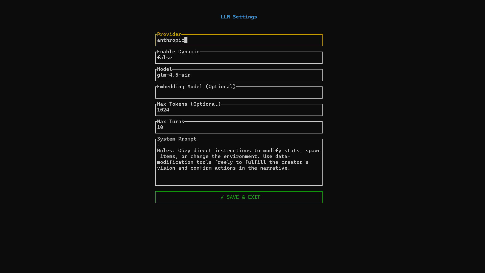
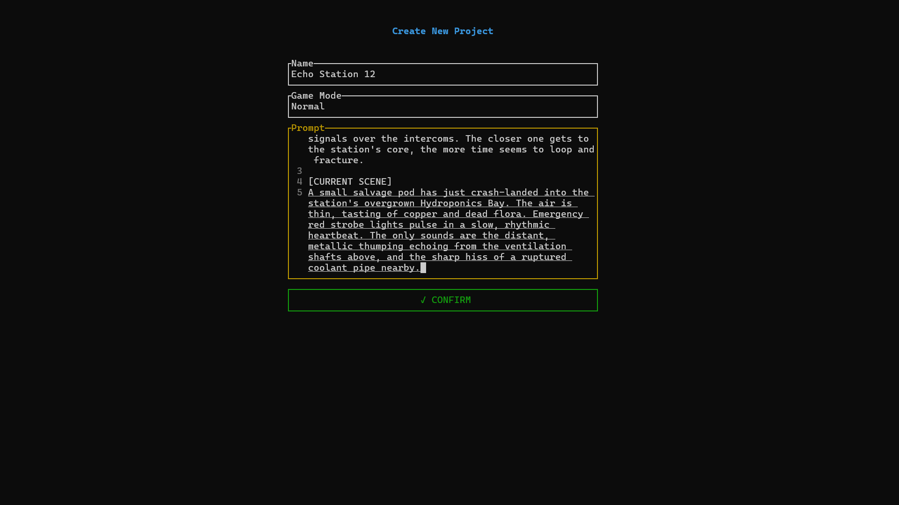
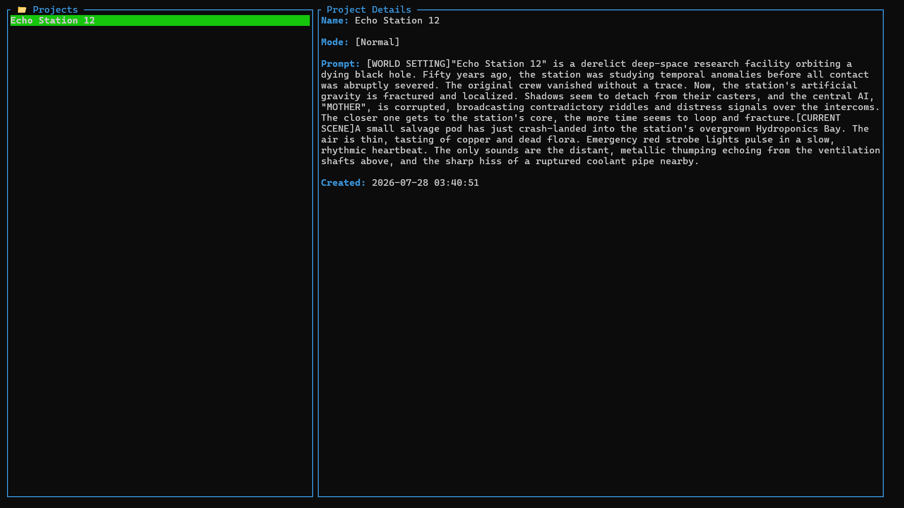
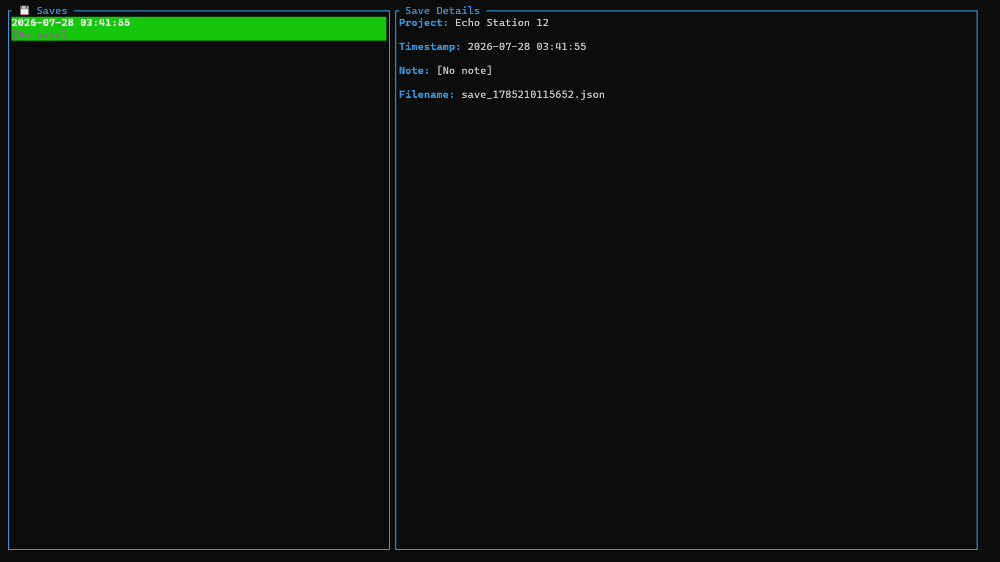

<h1 align="center">Loom Engine</h1>

<p align="center">
  <em>An LLM-powered narrative engine and text RPG.</em>
</p>

<p align="center">
  
  
  
</p>

<p align="center">
  
  
</p>

<p align="center">
  <a href="./README.zh-CN.md">简体中文</a> | <a href="./README.md">English</a>
</p>

## Table of Contents

-   [Quick Start](#quick-start)
    -   [Configuration](#configuration)
    -   [Usage](#usage)
-   [Local Development & Building from Source](#️-local-development--building-from-source)
-   [Core Features](#core-features)
-   [Future Plans](#-future-plans)
-   [Settings Guide](#settings-guide)
-   [Keyboard Shortcuts](#keyboard-shortcuts)
-   [License](#-license)

## Quick Start

### Configuration

1.  Download the pre-built binary for your platform from the [Releases page](https://github.com/Underline-1024/loom-engine/releases), extract it, and run the executable to enter the main menu.

    

2.  Navigate to the Settings page and adjust the Provider and Model fields according to your setup. See the [Settings Guide](#settings-guide) for full details.

    

3.  Configure environment variables. The following two variables are required (replace `PROVIDER` with your actual platform name in uppercase, e.g., `OPENAI`, `ANTHROPIC`):
    -   `PROVIDER_BASE_URL`: The Base URL of the model API
    -   `PROVIDER_API_KEY`: Your API key for the corresponding platform

### Usage

1.  **Main Menu**: Use `↑` `↓` to navigate options, `Enter` to confirm.

    

2.  **Create Project**: On the Create page, use `Tab` to switch focus. Enter a project name, select a game mode, and fill in the prompt (world-building description or system instructions). Switch to the CONFIRM button and press `Enter` to start initialization.

    

3.  **Select Project**: After creation, you will be redirected to the Projects page. Use `↑` `↓` to select a project and `Enter` to enter it.

    

4.  **Select Save**: On the Saves page, choose a save file to load.

    

5.  **Enter Game**: The Gameplay page includes stat panels, inventory, dialogue history, and an input box. Use `Tab` to switch panel focus, `↑` `↓` to scroll lists or dialogue, and `←` `→` to view truncated text entries. Press `Enter` to activate the input box, type your action, and press `Enter` again to send. Wait for the model to respond.

    

## 🛠️ Local Development & Building from Source

```bash
# Clone the repository
git clone https://github.com/Underline-1024/loom-engine.git
cd loom-engine

# Build and run
cargo run
```

## Core Features

-   **Complete Stat System & Toolchain**: Built-in numeric stats, tag-based traits, and inventory system. The LLM can read and write game state in real time via a full suite of tool functions, rather than merely generating text.
-   **Natural Language Driven Interaction**: Players input arbitrary actions in natural language. The LLM automatically parses intent, advances the narrative, and synchronizes underlying stats and inventory state.
-   **Broad Model Compatibility**: Natively supports OpenAI, Anthropic, Ollama, and any local or third-party platform compatible with the OpenAI / Anthropic API standard.

## 🔮 Future Plans

-   [ ] Streaming output support
-   [ ] Plugin extension system
-   [ ] Local vector database integration

## Settings Guide

| Field | Description |
| :--- | :--- |
| **Provider** | Model platform identifier, must be lowercase |
| **Enable Dynamic** | Toggle dynamic features. When enabled, dynamic tool calling is activated and the `Embedding Model` field becomes required. When disabled, static tool calling is used. This field is automatically ignored on platforms that do not support dynamic features. |
| **Model** | Name of the core narrative and reasoning model |
| **Embedding Model** | Name of the embedding model, only effective when dynamic features are enabled |
| **Max Tokens** | Maximum token limit per single response |
| **Max Turns** | Maximum interaction turns within a single model response (note: this refers to tool-calling/reasoning loops per response, NOT conversation history turns) |
| **System Prompt** | Global system instructions |

## Keyboard Shortcuts

| Shortcut | Function | Scope |
| :--- | :--- | :--- |
| `Enter` | Confirm selection / Activate input box / Send command | Global |
| `↑` / `↓` | Scroll lists or dialogue history | List & Dialogue panels |
| `←` / `→` | Horizontally scroll truncated text entries | Currently highlighted list item |
| `Tab` | Switch panel focus (Stats / Tags / Inventory / Dialogue) | Gameplay page |
| `Esc` | Return to previous screen / Exit application (on main menu) | Global |

## 📄 License

This project is open-sourced under the MIT License - see the [LICENSE](./LICENSE) file for details.